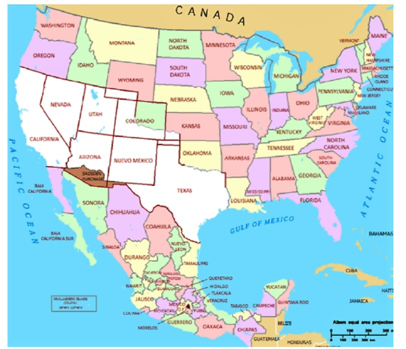

## The Beginning

> When did this narrative begin?

The story begins in the early 18th century when the United States, fueled by the ideology of Manifest Destiny, aimed to expand westward, seeking to assert its influence and control over new territories. At this point, the Louisiana Purchase had already doubled the size of the country, further inspiring expansion. 

Simultaneously, Mexico, having gained independence from Spain in 1821, faced internal challenges, struggling to define its own national identity and establish a stable government. While Americans believed they were destined to expand across the continent, this heightened tensions with the neighboring country Mexico (Foos 36). The border between the two nations became a hot spot, with each side asserting its claims to the vast territories of the Southwest, including Texas, New Mexico, and California. The Mexican government, aware of its tenuous hold on these distant lands, sought to establish control and prevent American interference. 

The United States, driven by a sense of destiny and fueled by a rapidly growing population, viewed these territories as integral to its vision of continental dominance. 
As American settlers moved westward, tensions mounted, and conflicts began. Cultural, economic, and political differences exacerbated the situation, laying the groundwork for a conflict that would come to a head in the form of the Mexican-American War (Knight 516).
In this complex web of historical forces, Section 1 sets the backdrop for the interplay between Mexican struggles for stability, and the collision of two nations on a quest for expansion and identity. 

> Ref: [title](paste link)

> A summary of the final land ownership:
* The Mexican Cession of the Treaty of Guadalupe Hidalgo, shown in white. The lands of the Gadsden Purchase are shown in brown. Author: National Atlas of the United States 
