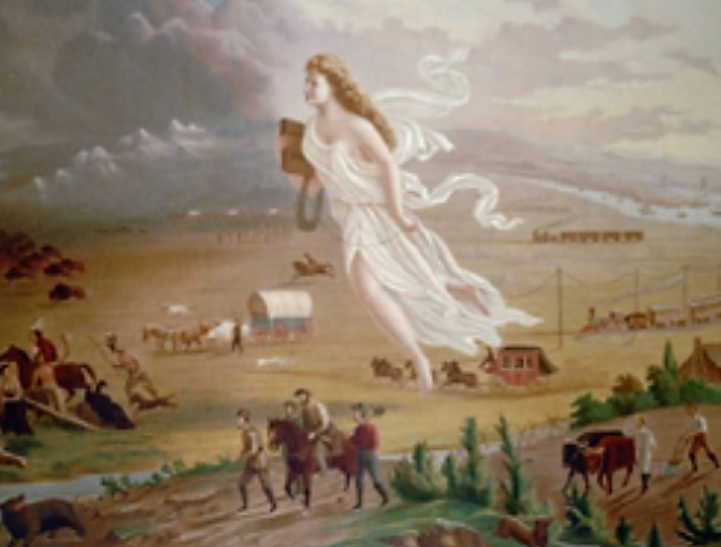

## Ideologies

> How did Manifest Destiny Influence Americans?

Manifest Destiny, a potent ideological force that emerged in the early 19th century, was “the American ‘destiny to overspread the whole North American content with an immense democratic population’” (Castillo 4) as described by the creator of the term, John O’ Sullivan. This became a driving factor in shaping the trajectory of American expansionism. At its core, Manifest Destiny encapsulated the conviction that the United States was preordained by a higher power to extend its influence and territorial reach across the North American continent. This belief system not only provided a moral justification for westward expansion but also fueled a sense of entitlement and exceptionalism among Americans because they believed they were spreading “the benefits of democracy and freedom to the lesser people inhabiting the region” (Castillo 4). 

The roots of Manifest Destiny can be traced back to the early days of the republic, but it gained significant momentum in the 1840s as the concept became intertwined with the spirit of American exceptionalism. Proponents of Manifest Destiny believed that the United States embodied democratic principles and represented a beacon of liberty and progress. They viewed westward expansion as a virtuous mission, a spreading of the American way of life that was destined to conquer the wilderness and civilize the frontier.
The allure of vast, unexplored territories and untapped resources beckoned to American pioneers, and Manifest Destiny provided a moral imperative for their westward migration. The ideology not only justified the desire for territorial expansion but also imbued it with a sense of righteousness.

In the context of disputed regions like Texas and the Southwest: Texas, originally a part of Mexico, became a focal point of American expansionist aspirations. Anglo-American settlers, drawn by promises of fertile land and economic opportunity, began to establish themselves in the region. The annexation of Texas into the United States in 1845 further intensified tensions with Mexico.

> Manifest Destiny:
*  John Gast painted American Progress in 1872. artist: John Gast Source: Library of Congress

The Southwest, encompassing present-day California, New Mexico, Arizona, and more, was also a hotbed of Manifest Destiny-driven ambitions. The lure of California's gold, the promise of fertile agricultural land, and strategic considerations all contributed to the American desire to control these territories War (Knight 117).

As the United States asserted its claims to these disputed regions, clashes with Mexico became inevitable. The sense of entitlement embedded in Manifest Destiny exacerbated conflicts, as Americans and Mexicans clashed over competing visions of territorial control. The ideological fervor of Manifest Destiny provided a potent backdrop to the events leading up to the Mexican-American War, as both nations grappled for dominance in the contested expanses of the Southwest.

In summary, Manifest Destiny was a powerful force that shaped American expansionism, fostering a sense of entitlement and moral superiority that justified westward expansion. In the disputed regions of Texas and the Southwest, this ideology played a pivotal role in driving the United States to assert its claims, setting the stage for conflicts that would ultimately reshape the map of North America.

