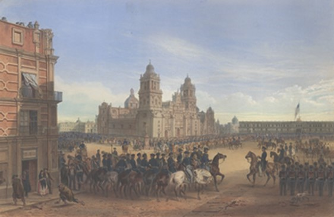

## Conclusion

> What were the impacts of the war?

There was opposition to the war from Abraham Lincoln, a Whig (a colonist who supported the American Revolution), and small groups who suspected the point of the war was to uplift slave owners while others such as a democrat named John C. Calhoun believed it would further strengthen the divide between slavery in different areas and some thought Mexicans would inspire slaves to work towards their goal of freedom (Castillo 5). 
In February 1848, The Treaty of Guadalupe Hidalgo was signed to end the Mexican-American War and the process known as the Mexican Cession claimed Texas, California, and New Mexio territories to be part of U.S. (Rice 1) who paid 15 million dollars and caused Mexico to lose over half its land (about 55%), only keeping the area south of the Rio Grande (Locks 1). The Mexicans, who were once landowners, became laborers (often on the same land they used to own) and were paid 2/3 less than white laborers and became more separated from American Society. The U.S could’ve overtaken more Mexican Land but refrained from doing so because they believed Mexicans were inferior and didn’t want mixed ancestry, but the ports in San Diego and San Francisco allowed trade with Asia which outweighed their concerns. 
Conclusion 
In 1854, the border between the United States and Mexico was settled through the Mesilla Treaty signed by the corrupt Mexican leader Santa Anna to allow the Gadsden Purchase in which the U.S. paid 10 dollars million for the Mesilla Valley in Arizona. The entire experience greatly strengthened the American military; however, the cost of the war added to about 100 million dollars and about 13,000 Americans died. Tensions between Americans and Mexicans were not resolved in any way, and conflicts over slavery increased as slavery was prohibited in any new territory from Mexico as part of the Wilmot Proviso bill which never became a law (Locks 1). 

> At war:
* General Scott’s Entrance into Mexico (1851) by Carl Nebe

